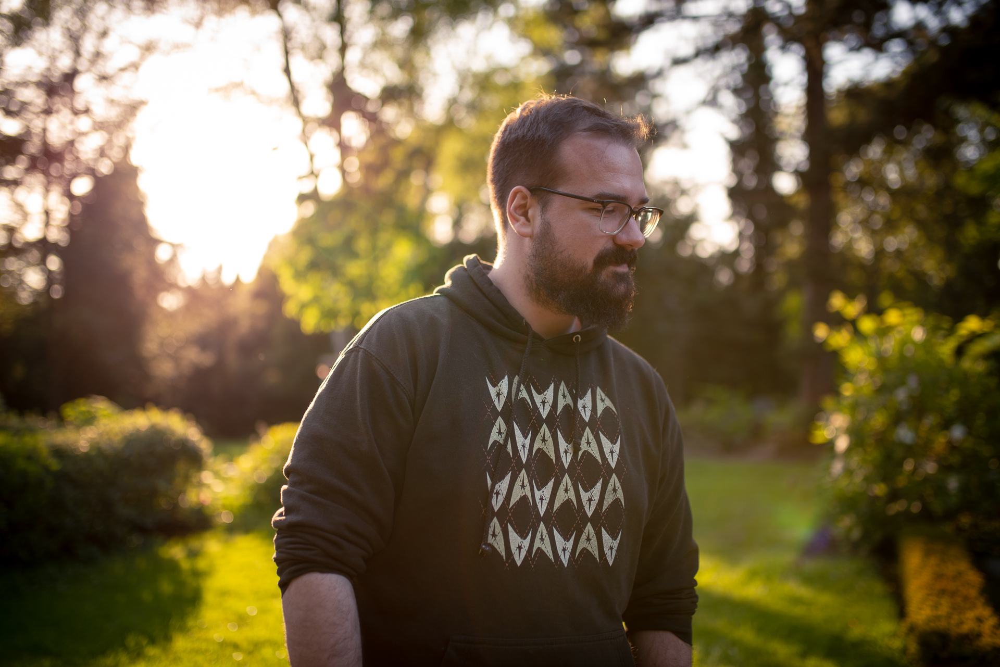

autoscale: true

# [fit] exercism.io 

# [fit] One Platform, Three Perspectives

[.footer: Nils Müller, real,- Digital Payment & Technology Services GmbH]

---

# About Me

---

# I am 31 years old, started coding at 26, became a Gopher about 1 year ago.

[.footer: Photo by [Jeanette Skwara](https://www.xing.com/profile/Jeanette_Skwara)]

---

# [fit] I live in Bielefeld, Germany.

[.footer: Photo by [Kevin Bückert](https://unsplash.com/@kwinmedia?utm_source=unsplash&amp;utm_medium=referral&amp;utm_content=creditCopyText) on [Unsplash](https://unsplash.com/s/photos/city-bielefeld?utm_source=unsplash&amp;utm_medium=referral&amp;utm_content=creditCopyText)]

---

# [fit] I love Japanese curry. :curry:

[.footer: Photo by [justonecookbook.com](https://www.justonecookbook.com/vegetarian-japanese-curry/)]

---

# [fit] Agenda

1. What is exercism.io?
1. As a Mentee
1. As a Mentor
1. As a Team

---

[.footer: Logo by [Exercism](https://assets.exercism.io/social/general.png)]

---

> Exercism is an online coding platform that offers code practice and mentorship.
-- [Wikipedia](https://en.wikipedia.org/wiki/Exercism)

---

# Where other online coding platforms are about challenges and competition, Exercism focusses on **community and compassion**.

---

# [fit] Exercism has

- A community of **330k users** in **200 countries**
- A group of **2.5k mentors** in **29 timezones**
- A variety of curated exercises in **50 programming languages**

[.footer: Source [Exercism](https://exercism.io/about)]

---

# [fit] As a Mentee

---

# I grew up learning new things being **on my own** and with **long feedback loops**.

---

# After finding out about online coding platforms, I often ditched learning a language **idiomatically** in favour of **performance** and **leader boards**.

---

# You often have to **unlearn old habits** in order to write **idiomatic code** when learning a **new language**.
---

# Exercism and its short feedback loop based on **human mentors** and **test-driven development** provides for a welcome change. 

---

# Is Exercism the **right platform** for me?

---

# It is great for learning your **second language**, as the exercises do not teach **programming concepts** explicitly.

---

# In addition, you should be comfortable using the **command line**.

---

# [fit] As a Mentor

---

# After being a **teaching assistant** at university, I wanted to keep on mentoring, but **didn't have the time** for in-person classes.

---

# I was looking for an **open community** where I could help mentoring **all people**, regardless of their backgrounds.

---

# Mission Statement

> To enable anyone to achieve fluency in any programming language for free, in order to give opportunity to all and improve the quality of software development worldwide.
-- [exercism.io](https://exercism.io/values)

---

# Values

> We envision a world where anyone from any background can become fluent in any programming language for free. Through programming exercises, resources and a safe and nurturing community.
-- [exercism.io](https://exercism.io/values)

---

# As a Mentor

- being able to identify with the values and mission statement
- lets you leverage your skills by helping many mentees at once
- easy entry because of community mentor notes
- recap core concepts
- get to know different view points, learn from mistakes you might've not made yourself
- help at your own pace without being rushed (compared to classroom setting)

---

## As a Team

- I introduced Exercism in my product area for remote code dojos
- convenient infrastructure for async discussion
- lots of tasks at different levels
- clearly defined tasks allow to concentrate on solving instead of discussing surrounding conditions

---

# [fit] Thank you! :tada: