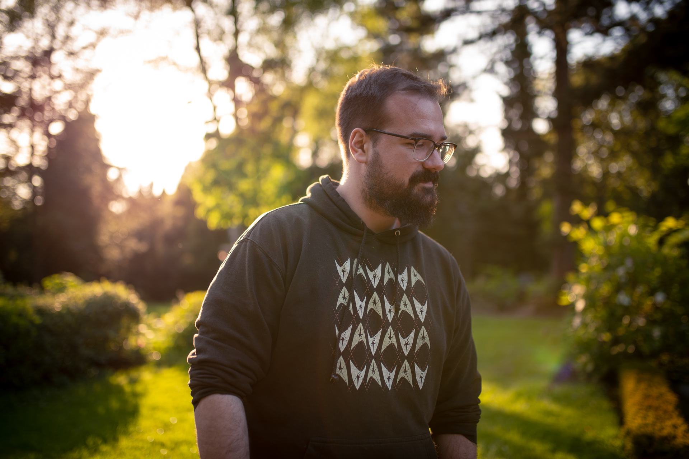
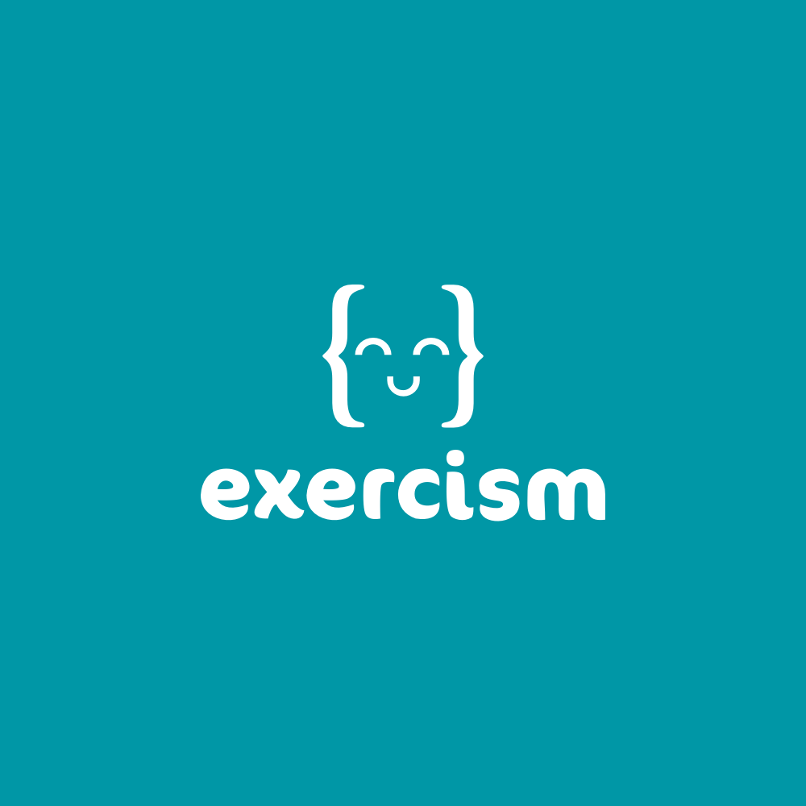

autoscale: true
footer: Nils Müller, real,- Digital Payment & Technology Services GmbH

# [fit] exercism.io 

# [fit] One Platform, Three Perspectives

---

# About Me

---

- 31 years old
- started coding at 26 
- Gopher for ~ 1 year
- live in Bielefeld[^1], Germany
- love Japanese curry :curry:

[^1]: Yes, it exists.

---

# Exercism

---

> Exercism is an online coding platform that offers code practice and mentorship.
-- [Wikipedia](https://en.wikipedia.org/wiki/Exercism)

---

# Mission Statement

> To enable anyone to achieve fluency in any programming language for free, in order to give opportunity to all and improve the quality of software development worldwide.
-- [exercism.io](https://exercism.io/values)

---

# Values

> We envision a world where anyone from any background can become fluent in any programming language for free. Through programming exercises, resources and a safe and nurturing community.
-- [exercism.io](https://exercism.io/values)

---

# As a Mentee

- well documented
- working on your own machine, using your own tools
- connects to mentors you otherwise might not have access to
- lets you explore in a safe environment
- teaches test-driven development

---

# As a Mentor

- lets you leverage your skills by helping many mentees at once
- easy entry because of community mentor notes
- recap core concepts
- get to know different view points, learn from mistakes you might've not made yourself
- help at your own pace without being rushed (compared to classroom setting)

---

## As a Team

- I introduced Exercism in my product area for remote code dojos
- convenient infrastructure for async discussion
- lots of tasks at different levels
- clearly defined tasks allow to concentrate on solving instead of discussing surrounding conditions

---

# [fit] Thank you! :tada: