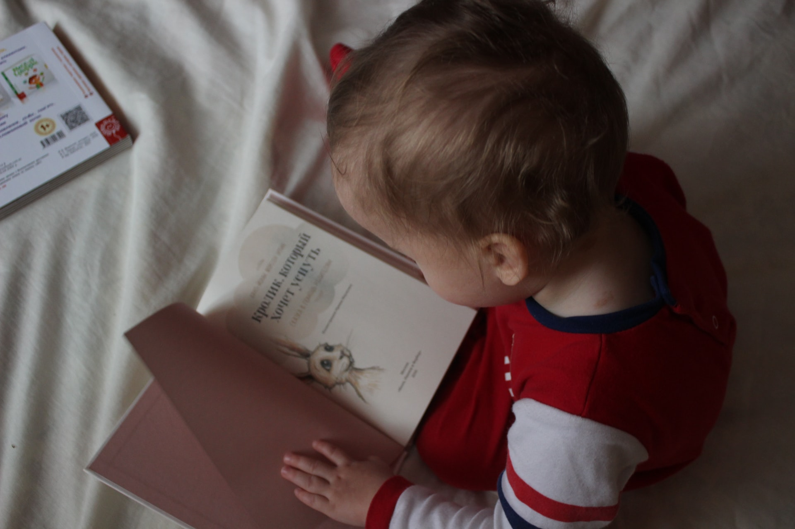
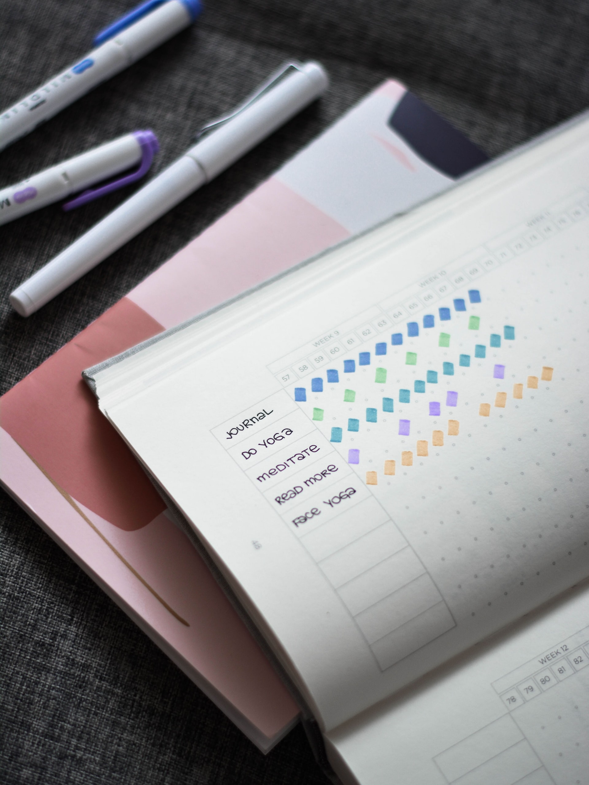
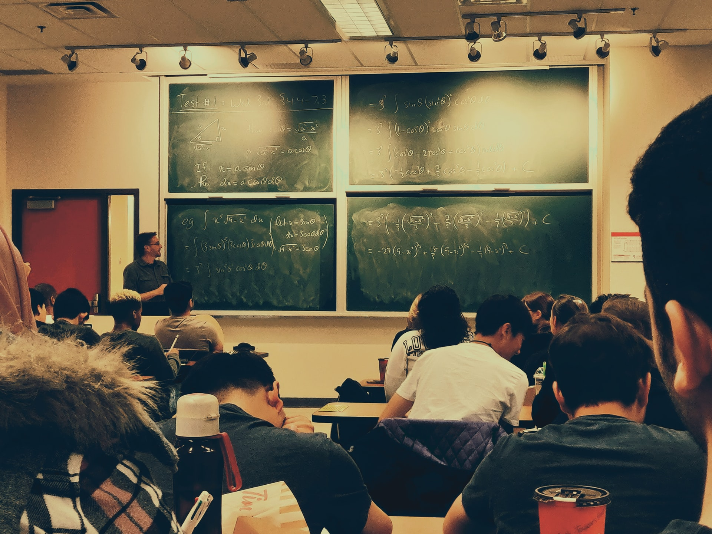
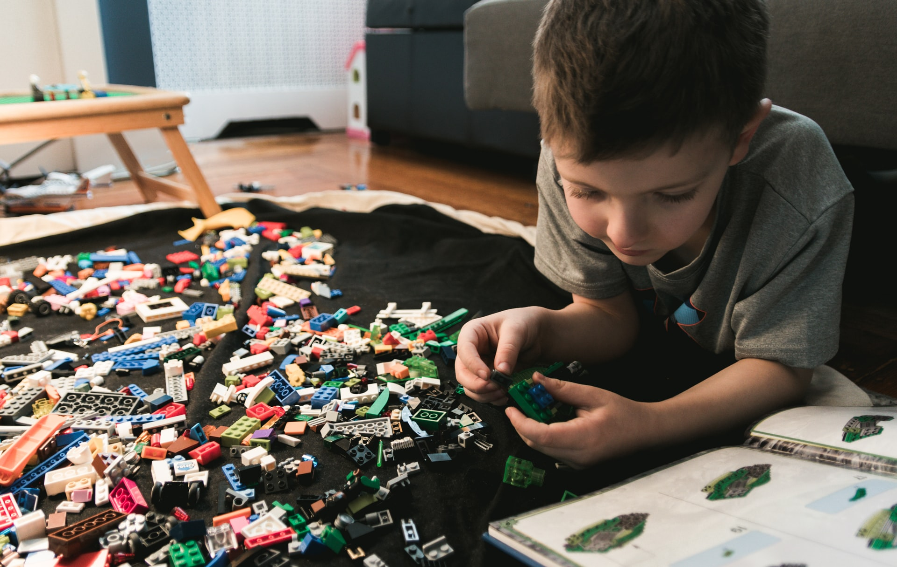

autoscale: true

# [fit] exercism.io 

# [fit] One Platform, Three Perspectives

[.footer: Nils Müller, real,- Digital Payment & Technology Services GmbH]

---

# [fit] About Me

---

# I am 31 years old, started coding at 26, became a Gopher about 1 year ago.

[.footer: Photo by [Jeanette Skwara](https://www.xing.com/profile/Jeanette_Skwara)]

---

# You can find me as [`@shimst3r`](https://twitter.com/shimst3r) on Twitter and GitHub. Please reach out. :wave:

[.footer: Photo by [Jeanette Skwara](https://www.xing.com/profile/Jeanette_Skwara)]

---

# [fit] I live in Bielefeld, Germany.

[.footer: Photo by [Kevin Bückert](https://unsplash.com/@kwinmedia?utm_source=unsplash&amp;utm_medium=referral&amp;utm_content=creditCopyText) on [Unsplash](https://unsplash.com/s/photos/city-bielefeld?utm_source=unsplash&amp;utm_medium=referral&amp;utm_content=creditCopyText)]

---

# I am working as an **infrastructure engineer** at real.digital[^1].

---

# [fit] I love Japanese curry. :curry:

[.footer: Photo by [justonecookbook.com](https://www.justonecookbook.com/vegetarian-japanese-curry/)]

---

# [fit] I really enjoy Go Time.[^2]

[.footer: Logo by [Changelog](https://changelog.com/gotime)]

---

# [fit] Agenda

1. What is exercism.io?
1. As a Mentee
1. As a Mentor
1. As a Team

---

[.footer: Logo by [Exercism](https://assets.exercism.io/social/general.png)]

---

> Exercism is an online coding platform that offers code practice and mentorship.
-- [Wikipedia](https://en.wikipedia.org/wiki/Exercism)

---

# Where other online coding platforms are about challenges and competition, Exercism focusses on **community and compassion**.

[.footer: Photo by [Tim Gouw](https://unsplash.com/@punttim?utm_source=unsplash&amp;utm_medium=referral&amp;utm_content=creditCopyText) on [Unsplash](https://unsplash.com/?utm_source=unsplash&amp;utm_medium=referral&amp;utm_content=creditCopyText)]

---

# [fit] Exercism has

- A community of **330k users** in **200 countries**
- A group of **2.5k mentors** in **29 timezones**
- A variety of curated exercises in **50 programming languages**

[.footer: Source [Exercism](https://exercism.io/about)]

---

# [fit] As a Mentee

---

# As I got **started with coding**, I was **on my own** and struggled with **long feedback loops**.

[.footer: Photo by [Iana Dmytrenko](https://unsplash.com/@yasya?utm_source=unsplash&amp;utm_medium=referral&amp;utm_content=creditCopyText) on [Unsplash](https://unsplash.com/s/photos/learning-child?utm_source=unsplash&amp;utm_medium=referral&amp;utm_content=creditCopyText)]

---

# I didn't know **where to start**.

# Or **how**.

[.footer: Photo by [Jukan Tateisi](https://unsplash.com/@tateisimikito?utm_source=unsplash&amp;utm_medium=referral&amp;utm_content=creditCopyText) on [Unsplash](https://unsplash.com/s/photos/start?utm_source=unsplash&amp;utm_medium=referral&amp;utm_content=creditCopyText)]

---

# As I tried **new languages**, I had trouble unlearning **old habits**.

[.footer: Photo by [Prophsee Journals](https://unsplash.com/@prophsee?utm_source=unsplash&amp;utm_medium=referral&amp;utm_content=creditCopyText) on [Unsplash](https://unsplash.com/s/photos/habit?utm_source=unsplash&amp;utm_medium=referral&amp;utm_content=creditCopyText)]

---

# Exercism mentors will **support** you and guide you to **idiomatic code**.

[.footer: Photo by [Joshua Ness](https://unsplash.com/@theexplorerdad?utm_source=unsplash&amp;utm_medium=referral&amp;utm_content=creditCopyText) on [Unsplash](https://unsplash.com/s/photos/human-mentor?utm_source=unsplash&amp;utm_medium=referral&amp;utm_content=creditCopyText)]

---

# Each exercise comes with a **test suite** for **immediate feedback**.

[.footer: Photo by [Annie Spratt](https://unsplash.com/@anniespratt?utm_source=unsplash&amp;utm_medium=referral&amp;utm_content=creditCopyText) on [Unsplash](https://unsplash.com/s/photos/test-math?utm_source=unsplash&amp;utm_medium=referral&amp;utm_content=creditCopyText">Unsplash</a>)]

---

# The **Go track** comes with **109 exercises**[^3] of varying difficulty.

# It starts with **Hello World** and extends your knowledge **little by little**.

[.footer: Photo by [Delaney Van](https://unsplash.com/@delaneyvan?utm_source=unsplash&amp;utm_medium=referral&amp;utm_content=creditCopyText) on [Unsplash](https://unsplash.com/s/photos/dumbbell?utm_source=unsplash&amp;utm_medium=referral&amp;utm_content=creditCopyText)]

---

# [fit] Mentee Guide

To get the most out of Exercism:

- Ask you mentors **all the questions**.
- **Compare your solutions** to those of other mentees.
- **Explore** the language in the safe environment.

---

# [fit] As a Mentor

---

# After being a **teaching assistant** at university, I wanted to keep on mentoring, but **didn't have the time** for in-person classes.

[.footer: Photo by [Shubham Sharan](https://unsplash.com/@shubhamsharan?utm_source=unsplash&amp;utm_medium=referral&amp;utm_content=creditCopyText) on [Unsplash](https://unsplash.com/s/photos/university-students?utm_source=unsplash&amp;utm_medium=referral&amp;utm_content=creditCopyText)]

---

# I was looking for an **open community** where I could help mentoring people **regardless of their backgrounds**.

[.footer: Photo by [Viktor Forgacs](https://unsplash.com/@sonance?utm_source=unsplash&amp;utm_medium=referral&amp;utm_content=creditCopyText) on [Unsplash](https://unsplash.com/s/photos/open?utm_source=unsplash&amp;utm_medium=referral&amp;utm_content=creditCopyText)]

---

# These guiding principles are closely resembled by Exercism's **value proposition**:

[.footer: Photo by [Riccardo Annandale](https://unsplash.com/@pavement_special?utm_source=unsplash&amp;utm_medium=referral&amp;utm_content=creditCopyText) on [Unsplash](https://unsplash.com/s/photos/value?utm_source=unsplash&amp;utm_medium=referral&amp;utm_content=creditCopyText)]

---

# Value Proposition

> We envision a world where anyone from any background can become fluent in any programming language for free. Through programming exercises, resources and a safe and nurturing community.
-- [exercism.io](https://exercism.io/values)

---

# Mentoring on Exercism is a great way of becoming a **better developer** and a **humble teacher**.

[.footer: Photo by [Oxa Roxa](https://unsplash.com/@oxaroxa?utm_source=unsplash&amp;utm_medium=referral&amp;utm_content=creditCopyText) on [Unsplash](https://unsplash.com/s/photos/humble?utm_source=unsplash&amp;utm_medium=referral&amp;utm_content=creditCopyText)]

---

# Great **community mentor notes** are there to help you out when in doubt.

[.footer: Photo by [David Travis](https://unsplash.com/@dtravisphd?utm_source=unsplash&amp;utm_medium=referral&amp;utm_content=creditCopyText) on [Unsplash](https://unsplash.com/s/photos/notes?utm_source=unsplash&amp;utm_medium=referral&amp;utm_content=creditCopyText)]

---

# Because of the **asynchronous** nature of the platform, you can mentor at your **own pace**.

[.footer: Photo by [Dmitry Schemelev](https://unsplash.com/@enioku?utm_source=unsplash&amp;utm_medium=referral&amp;utm_content=creditCopyText) on [Unsplash](https://unsplash.com/s/photos/walking?utm_source=unsplash&amp;utm_medium=referral&amp;utm_content=creditCopyText)]

---

# [fit] Mentor Guide

How to be a supportive mentor:

- Be **humble and patient**.
- Make use of the **community mentor notes**.
- **Don't rush** yourself!

---

# [fit] As a Team

---

# In August 2020, real.digital decided to go **remote-first**.

[.footer: Image by [real.digital](https://www.real-digital.de/blog/allgemein/real-digital-wird-zur-remote-first-company/)]

---

# While it made life easier in general, it made **knowledge transfer** more difficult.

[.footer: Photo by [Markus Winkler](https://unsplash.com/@markuswinkler?utm_source=unsplash&amp;utm_medium=referral&amp;utm_content=creditCopyText) on [Unsplash](https://unsplash.com/s/photos/sharing?utm_source=unsplash&amp;utm_medium=referral&amp;utm_content=creditCopyText)]

---

# To counter this, I proposed the introduction of **remote coding dojos** using Exercism.

[.footer: Photo by [Thao Le Hoang](https://unsplash.com/@h4x0r3?utm_source=unsplash&amp;utm_medium=referral&amp;utm_content=creditCopyText) on [Unsplash](https://unsplash.com/s/photos/martial-arts?utm_source=unsplash&amp;utm_medium=referral&amp;utm_content=creditCopyText)]

---

# [fit] Why Exercism?

- lots of exercises at **different levels of difficulty**
- **clearly defined** tasks
- infrastructure for **async discussion**

---

# [fit] How does it work?

[.footer: Photo by [Kelly Sikkema](https://unsplash.com/@kellysikkema?utm_source=unsplash&amp;utm_medium=referral&amp;utm_content=creditCopyText) on [Unsplash](https://unsplash.com/s/photos/instruction?utm_source=unsplash&amp;utm_medium=referral&amp;utm_content=creditCopyText)]

---

# Each session has a **theme**, like **algorithms** or **datastructures**.

[.footer: Photo by [Yaopey Yong](https://unsplash.com/@yaopey?utm_source=unsplash&amp;utm_medium=referral&amp;utm_content=creditCopyText) on [Unsplash](https://unsplash.com/s/photos/theme?utm_source=unsplash&amp;utm_medium=referral&amp;utm_content=creditCopyText)]

---

# We start by **introducing** the exercises, with an emphasise on what **to learn** and what **to watch out for**.

[.footer: Photo by [Milan De Clercq](https://unsplash.com/@mdc_photography2000?utm_source=unsplash&amp;utm_medium=referral&amp;utm_content=creditCopyText) on [Unsplash](https://unsplash.com/s/photos/watch-out?utm_source=unsplash&amp;utm_medium=referral&amp;utm_content=creditCopyText)]

---

# Depending on the group size, we work **in pairs** or **as a mob**[^4].

[.footer: Photo by [Ratapan Anantawat](https://unsplash.com/@rtp_atw?utm_source=unsplash&amp;utm_medium=referral&amp;utm_content=creditCopyText) on [Unsplash](https://unsplash.com/s/photos/shibuya-crossing?utm_source=unsplash&amp;utm_medium=referral&amp;utm_content=creditCopyText)]

---

# We set aside **30 minutes** each for **solving the exercises** and **discussing the solutions** afterwards.

[.footer: Photo by [Marcelo Leal](https://unsplash.com/@marceloleal80?utm_source=unsplash&amp;utm_medium=referral&amp;utm_content=creditCopyText) on [Unsplash](https://unsplash.com/s/photos/timer?utm_source=unsplash&amp;utm_medium=referral&amp;utm_content=creditCopyText)]

---

# **Following** each session, the Exercism platform can be used to **discuss open points**.

---

# [fit] Team Guide

1. Choose a **theme** and pick suiting **exercises**
3. Emphasise **learning outcomes**
4. **30 minutes** each of **coding and discussion**
6. ...
7. Profit!

---

# [fit] Executive Summary

Exercism is 

- an **open and welcoming** coding platform
- **benefiting** mentees and mentors alike
- a great tool for **remote knowledge sharing**

---

# [fit] Thank you! :tada:

[^1]: [We are hiring](https://www.real-digital.de/team/tech/)! 

[^2]: Unpopular opinion: Mat Ryer is quite funny.

[^3]: As of Dec 2020

[^4]: See [Code with the Wisdom of the Crowd](https://www.oreilly.com/library/view/code-with-the/9781680506297/)
